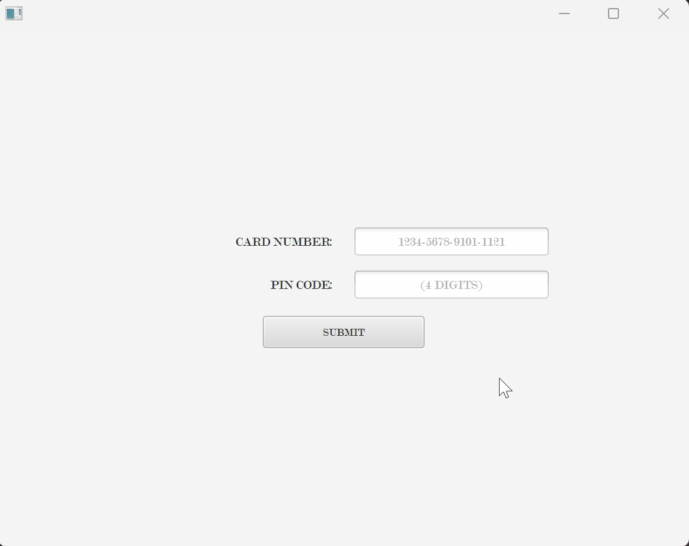

# ATM APP

ATM APP is an in-progress Java portfolio project that models a simple ATM workflow with a JavaFX desktop interface, PostgreSQL persistence, and a layered Java architecture.

The goal of this project is to demonstrate practical backend and desktop application skills: authentication flow, database access with JDBC, service-layer validation, custom exceptions, session handling, and a JavaFX UI split into FXML views and controllers.

## Application Preview



## Project Status

This project is still under active development. It is functional in parts, but it is not presented as a finished banking product.

Currently implemented:

- JavaFX login screen with card number and PIN input formatting
- PIN verification using hashed PIN values
- Failed login tracking and customer lock handling
- Session creation, session refresh, and logout flow
- Customer main menu
- Deposit and withdrawal workflows
- Balance lookup logic in the service layer
- PostgreSQL-backed customer and authentication data access
- Customer administration service methods for creating, updating, and deleting customers

Still in progress:

- Database schema and seed scripts are not included yet
- Automated tests are not included yet
- Admin/customer management UI is not implemented yet
- Packaging/distribution setup is not finalized

## Tech Stack

- Java 24
- JavaFX 25
- Maven
- PostgreSQL
- JDBC
- Spring Security Crypto for PIN hashing/verification

## Project Structure

```text
src/main/java/com/atm/
    config/       Database configuration
    dao/          JDBC data access objects
    domain/       Domain models
    dto/          Request/record objects
    exception/    Custom application exceptions
    gui/          JavaFX application, navigation, controllers, and FXML views
    service/      Business logic
    session/      Session lifecycle handling
    util/         Validation, security, and helper utilities
src/main/resources/com/atm/gui/view/
    JavaFX FXML views
```

## Requirements

- JDK 24 or compatible configured locally
- Maven
- PostgreSQL database

The application reads database connection settings from environment variables:

```text
URL=jdbc:postgresql://localhost:5432/your_database
USER=your_database_user
PASSWORD=your_database_password
```

## Running the App

Install dependencies and compile:

```bash
mvn clean compile
```

Run the JavaFX application:

```bash
mvn javafx:run
```

The app expects a PostgreSQL database with a `customers` table compatible with the DAO queries in `src/main/java/com/atm/dao`. A schema file has not been added yet, so database setup is currently manual.

## Portfolio Notes

This repository is intended to show the evolution of a Java desktop application rather than a polished final release. Some implementation details are intentionally visible while the project is being built, including TODOs, unfinished screens, and incremental refactors.

Areas this project demonstrates:

- Separating UI, service, DAO, domain, and utility responsibilities
- Handling user sessions in a desktop application
- Validating money movement rules before updating account balances
- Protecting PINs with hashing instead of storing plain text
- Using custom exceptions to model application-specific failures
- Working with JavaFX FXML screens and controllers

## License

This project is licensed under the MIT License. See [LICENSE](LICENSE) for details.
